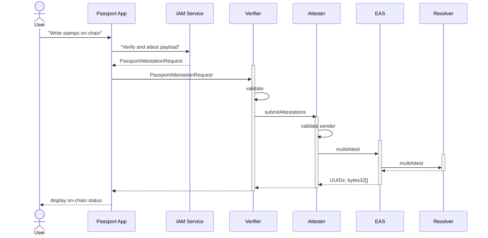

# Framework
The framework chosen for strong stamps on-chain is EAS (see https://attest.sh/ ).

EAS provides the following facilities / feature:
- recipient
- attester
- issuance & optional expiry date
- revocation
- it also allows specifying an optional resolver smart contract, which will be invoked for the attestations that are about to be written on-chain: https://github.com/ethereum-attestation-service/eas-contracts/blob/master/contracts/resolver/ISchemaResolver.sol




## Discoverability of attestations
For our use-case it is important that given an ETH address of a user, we are able to determine all the stamps that the user owns.
The EAS smart contract does not offer this functionality.
However we can create a resolver smart contract that will track all the attestations (stamps, scores) issued for a particular address.


# EAS Schema
This section presents several ways of bringing stamps on-chain and discusses the potential benefits of each.

## Stamp Attestation
In this approach we will bring each stamp as an individual attestation.

Each attestation would need to track the following data:

- *provider* - the stamp provider is a unique string that is determined when the stamp is designed. In order to store that string efficiently on-chain however we will store the hash of the provider name to save on gas costs
- *hash* - the hash of the stamp is a base64 encoded sha256 checksum of the stamp record. When storing it on-chain we will store only the sha56 checksum of the stamp into a bytes32 field.

The schema of the stamp looks like:
```js
new SchemaEncoder(
   "bytes32 provider, bytes32 hash"
);
```


## Discoverability
As mentioned above we will use a resolver smart contract in order to track which stamps a user owns. The resolver smart contract would store the stamps in a nested mapping like:

    recipient => provider (bytes32 hash) => attestation UUID

In solidity this would translate to:

    mapping(address => mapping(bytes32 => bytes32)) public stamps

Given this structure, we would be able to retrieve the UUID for any stamp attestation of a particular recipient. 

## Updating stamps
Whenever the user makes changes to his passport in the Passport app, the user will also have the possibility to update his on-chain passport.
Following changes are possible in the Passport App:
- new stamps added to the passport - in this case a new stamp attestation shall be created in EAS
- deletion of stamps from the passport - open point: shall we revoke the attestation ???
- updating stamps from the passport:
    - updating only the metadata (like refreshing stamp causes the issuance date to be updated) - 
        - TODO open point: shall we revoke & re-issue the attestation ???
    - updating a stamp with a different account or credentials (for example verifying a different Google account). This will result in a new hash for the same provider 
        - TODO open point: shall we revoke & re-issue the attestation ???

## Passport Attestation
TODO

# Integrations
## How to Score a Passport
### Stamp Attestations
### Passport Attestations
