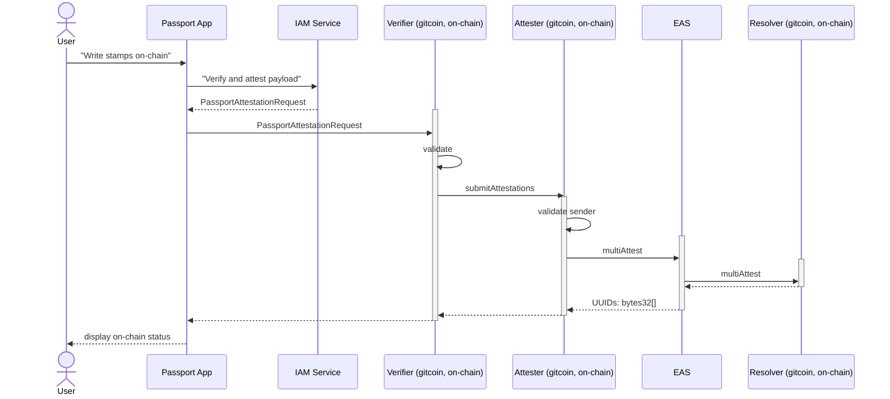

# Intro

----

This documentation is outdated. The latest version has been moved to: https://github.com/gitcoinco/eas-proxy/tree/on_chain_docs/docs

----

The purpose of this document is to:
- explain the current flow that is implemented as well as the next steps that are still pending
- highlight the open points, and the points where a decision is pending


Open points
- [ ] decisioin regarding the schema (if we preffer the Stamp Attestation or Passport Attestations). The gas usage for higher number of stamps is significantly in favour of the Passport Attestations.
- [ ] decision if we want to revoke older stamps or not. If not, we will rely only on the latest 'snapshot' of a stamp for a giveb provider 

# Framework
The framework chosen for strong stamps on-chain is EAS (see https://attest.sh/ ).

EAS provides the following feature:
- it stores attestation metadata:
    - recipient
    - attester
    - issuance & optional expiry date
- supports attestation revocations
- it also allows specifying an optional resolver smart contract, which will be invoked for the attestations that are about to be written on-chain: https://github.com/ethereum-attestation-service/eas-contracts/blob/master/contracts/resolver/ISchemaResolver.sol

The flow to bring stamps on-chain is highlighted in the diagram below:


**ℹ️❗Note**:
- a first version of the `Verifier` and `Attester` smart contracts is already implemented and tested
- the `Receiver` is still pending

## Discoverability of attestations
For our use-case it is important that given an ETH address of a user, we are able to determine all the stamps that the user owns.
The EAS smart contract does not offer this functionality.
However we can create a resolver smart contract that will track all the attestations (stamps, scores) issued for a particular address.


# EAS Schema
This section presents several ways of bringing stamps on-chain and discusses the potential benefits of each.

## Stamp Attestation - Option 1
This section describes the 1st option of bringing passports on-chain, and that is: bring each stamp as an individual attestation on-chain.

In this approach we will bring each stamp as an individual attestation.

Each attestation would need to track the following data:

- *provider* - the stamp provider is a unique string that is determined when the stamp is designed. In order to store that string efficiently on-chain however we will store the hash of the provider name to save on gas costs
- *hash* - the hash of the stamp is a base64 encoded sha256 checksum of the stamp record. When storing it on-chain we will store only the sha56 checksum of the stamp into a bytes32 field.

The schema of the stamp looks like:
```js
new SchemaEncoder(
   "bytes32 provider, bytes32 hash"
);
```


### Discoverability
As mentioned above we will use a resolver smart contract in order to track which stamps a user owns. The resolver smart contract would store the stamps in a nested mapping like:

    recipient => provider (bytes32 hash) => attestation UUID

In solidity this would translate to:

    mapping(address => mapping(bytes32 => bytes32)) public stamps

Given this structure, we would be able to retrieve the UUID for any stamp attestation of a particular recipient. 

### Updating stamps
Whenever the user makes changes to his passport in the Passport app, it shall be possible to update the on-chain passport to currectly reflect the same state as the off-chain passport.

Following changes are possible in the Passport App:
- adding new stamps to thepassport
    - in this case a new stamp attestation shall be created in EAS
- deletion of stamps from the passport
    - ❓TODO open point: shall we revoke the attestation ???
- refreshing a stamp in the passport:
    - updating only the metadata (like refreshing stamp causes the issuance date to be updated)
    - ❓TODO open point: shall we revoke & re-issue the attestation ??? Even if we re-issue, we con't capture the exact date of issuance in our attestation (unless we add a field for this, which adds more gas ...)
- updating a stamp with a different account or credentials (for example verifying a different Google account). This will result in a new hash for the same provider 
    - ❓TODO open point: shall we revoke & re-issue the attestation ???

## Passport Attestation - Option 2
This section describes the 2nd option of bringing passports on-chain, and that is: bring an entire passport on-chain as a single attestation.

The schema proposed for storing passports is the following:
```js
new SchemaEncoder(
   "bytes32[] providers, bytes32[] hashes"
);
```

**providers** - this field shall indicate which stamps (i. e. which providers) a user has in his passport. This field is declared as an array of `bytes32` but it shall be used as a array of bits, meaning:
- we will use an ordered list of providers, and we will assign each of the providers a position in the bytes32 array and a bit: 
    - position 0, bit 0x0000000000000001: Brightid
    - position 0, bit 0x0000000000000002: unityStakingBronze
    - position 0, bit 0x0000000000000004: CommunityStakingGold
    - position 0, bit 0x0000000000000008: CommunityStakingSilver
    - position 0, bit 0x000000000000000f: Coinbase
    - position 0, bit 0x0000000000000010: Discord
- we will set the coresponding bit of the element in the `providers` field to 0, if a user does have the stamp for the providers who is assigned that bit

**hashes** - this field shall record the individual hashes for each stamp a user owns:
- this will be an ordered list, the hashes will be writted in the order of the providers as defined for the `providers` field
- this field will only record the hashes for the stamps that a user owns, meaning we will skip any elements where the provider bit is set to 0 in the `providers` field

Considering the list of providers abovem if a user has the `BrightId`, `CommunityStakingSilver` and `Discord` stamps, his attestation will look like:
```json
{
    "providers": [0x0000000000000019],  
    "hashes": [0x0000000000000001, 0x0000000000000002, 0x0000000000000003],  
}
```
The 3 bits coresponding to each position of the providers will be set to 0 in the first element in providers, and we record the 3 hashes in the `hashes` field.

### Discoverability
As mentioned above we will use a resolver smart contract in order to track which stamps a user owns. The resolver smart contract would store the attestation that contains the passport for each user:

    recipient => attestation UUID

In solidity this would translate to:

    mapping(address => bytes32) public passports;

Given this structure, we would be able to retrieve the UUID for any passport attestation of a particular recipient.

### Updating passport
Whenever the user makes changes to his passport in the Passport app, it shall be possible to update the on-chain passport to currectly reflect the same state as the off-chain passport.

Following changes are possible in the Passport App:
- adding new stamps to the passport
    - in this case a new passport attestation shall be created in EAS
    - ❓TODO open point: shall we revoke the older attestation ???
- deletion of stamps from the passport
    - similar like for the case of adding new stamps, a new passport attestation shall be created in EAS
    - ❓TODO open point: shall we revoke the older attestation ???
- refreshing a stamp in the passport:
    - updating only the metadata (like refreshing stamp causes the issuance date to be updated). As we don't record the issuance date there is no action to be taken on-chain for this.
- updating a stamp with a different account or credentials (for example verifying a different Google account). This will result in a new hash for the same provider 
    - similar like for the case of adding new stamps, a new passport attestation shall be created in EAS
    - ❓TODO open point: shall we revoke the older attestation ???


# Integrations
## How to Score a Passport

### Stamp Attestation - Option 1

```solidity

contract Scorer {
    ...
    
    // Define the list of supported providers.
    // We store the hash of the providers here
    bytes32 providers[] = [0x0000000000000001, 0x0000000000000002, 0x0000000000000003, ...]

    // Define your weights to be used for scoring
    // This is a map of the form <provider hash> => weight
    mapping(bytes32 => uint256) weights;

    // We also make use of the resolver that we have specified for the schema
    Resolver stampResolver;
    ...

    function scorePassport(address recipient) public returns(uint256) {
        uint256 i;
        uint256 score;
    
        // Get the passport for the provider
        mapping(bytes32 => bytes32) passport = stampResolver.stamps[recipient];

        // Iterate all the providers and add the weight to the score if 
        // the user holds that provider
        for(i = 0; i<providers.length; i++) {
            bytes32 provider = providers[i];
            if(passport[provider] > 0) {

                // TODO: deduplicate ...
                score += weight[provider];
            }
        }

        return score;
    }

    ...
}

```


### Passport Attestation - Option 2 (in progress)

```solidity

contract Scorer {
    ...
        
    // Define the list of supported providers.
    // We store the hash of the providers here
    mapping(bytes32 => uint256) weights[] = ...;

    // We also make use of the resolver that we have specified for the schema
    Resolver passportResolver;
    ...

    function scorePassport(address recipient) public returns(uint256) {
        uint256 i;
        uint256 score;
        
        bytes32 passportUUID = passportResolver.passports[provider];
    
        if(passportUUID) {
        }
        return score;
    }

    ...
}

```

